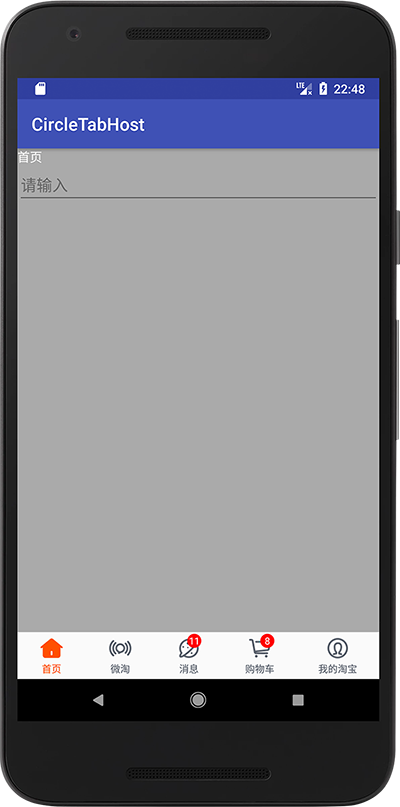

# CircleTabHost
初始版本上传

### 概述
这是一个Android Library 实现带角标数字的FragmentTabHost

效果图如下：



### 使用教程

1.在module的build.gradle引用类库
```groovy 
dependencies {
    implementation fileTree(include: ['*.jar'], dir: 'libs')

    implementation project(':circletabhost')
}
```
2.在布局文件里使用CircleTabHost控件
```xml
<?xml version="1.0" encoding="utf-8"?>
<LinearLayout xmlns:android="http://schemas.android.com/apk/res/android"
    xmlns:app="http://schemas.android.com/apk/res-auto"
    xmlns:tools="http://schemas.android.com/tools"
    android:layout_width="match_parent"
    android:layout_height="match_parent"
    android:orientation="vertical"
    tools:context=".MainActivity">

    <FrameLayout
        android:id="@+id/content_id"
        android:layout_width="match_parent"
        android:layout_height="0dp"
        android:layout_weight="1"
        android:background="@android:color/darker_gray"/>

    <com.hutao.circletabhost.widget.CircleTabHost
        android:id="@+id/circle_tab_id"
        android:layout_width="match_parent"
        android:layout_height="wrap_content"
        app:tab_text_size="11dp"
        app:tab_text_color="#5D646F"
        app:tab_text_select_color="#FF5001" />
</LinearLayout>
```
3.在代码是实例化控件并添加Tab
```java
//图标
int[] tabIco = {R.drawable.home_sel, R.drawable.tfaccount_sel,
        R.drawable.discover_sel, R.drawable.cart_sel,
        R.drawable.account_sel};
//文本
String[] tabTitle = getResources().getStringArray(R.array.tab_title);
//Fragment
Class<?>[] tabFragment = {BlankFragment1.class, BlankFragment2.class,
        BlankFragment3.class, BlankFragment4.class, BlankFragment5.class};
//实例化TabHost
CircleTabHost circleTabHost = findViewById(R.id.circle_tab_id);
for (int i = 0; i < tabTitle.length; i++) {
    //实例化Tab
    CircleTabHost.TabParam tabParam = new CircleTabHost.TabParam(tabIco[i], tabTitle[i], tabFragment[i]);
    //添加Tab
    circleTabHost.addTab(tabParam);
}
//配置FragmentManager和Content id
circleTabHost.setup(getSupportFragmentManager(), R.id.content_id);
//回调方法
circleTabHost.setOnTabListener(new CircleTabHost.OnTabListener() {
    @Override
    public void onTabChange(int index, CircleTabHost.TabParam param) {

    }
});
//设置角标
circleTabHost.setCornerMark(2, "11");
circleTabHost.setCornerMark(3, "8");
```